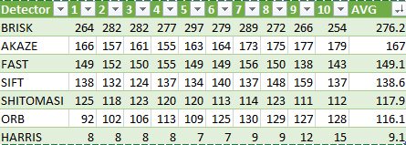

# Camera Based 2D Feature Tracking

- [Camera Based 2D Feature Tracking](#camera-based-2d-feature-tracking)
  - [General Refactoring](#general-refactoring)
  - [MP.1 Data Buffer Optimization](#mp1-data-buffer-optimization)
  - [MP.2 Keypoint Detection](#mp2-keypoint-detection)
  - [MP.3 Keypoint Removal](#mp3-keypoint-removal)
  - [MP.4 Keypoint Descriptors](#mp4-keypoint-descriptors)
  - [MP.5 Descriptor Matching](#mp5-descriptor-matching)
  - [MP.6 Descriptor Distance Ratio](#mp6-descriptor-distance-ratio)
  - [MP.7 Performance Evaluation 1: Count the number of keypoints for all 10 images](#mp7-performance-evaluation-1-count-the-number-of-keypoints-for-all-10-images)
  - [MP.8 Performance Evaluation 2: Count the number of matched keypoints for all 10 images using all possible combinations of detectors and descriptors.](#mp8-performance-evaluation-2-count-the-number-of-matched-keypoints-for-all-10-images-using-all-possible-combinations-of-detectors-and-descriptors)
  - [MP.9 Performance Evaluation 3: Log times & pick top 3](#mp9-performance-evaluation-3-log-times--pick-top-3)

## General Refactoring

I have refactored the main keypoint matching function into `run_data_collection` to be able to easily assemble the necessary results

## MP.1 Data Buffer Optimization

I would normally use `boost` for this with the data structure already implemented, however, since there is not that much code to write here and it's used only once, and the grader probably doesn't have `boost` installed, I just used the `std::vector` with `std::rotate` to implement the cyclic buffer.

## MP.2 Keypoint Detection

`HARRIS` is an old detector requiring its own `OpenCV` call for corner detection and then post-processing and NMS. I used the code we worked on during the excercise in the lessons to implement these stages of `HARRIS` detector. 

All the rest of the detectors are nicely packaged by `OpenCV` into their own static `create()` functions and all derive from `cv::FeatureDetector`, so a cast and a call to the virtual `detect` does the job. I have refactored the selection logic into `createDetectorOfType`

## MP.3 Keypoint Removal

This is accomplished by a call to 2 STL functions: `std::remove_if` moves all we want to remove to the end of the data structure and then `std::erase` finishes the job. `OpenCV` has a nice helper function `cv::Rect::contains` that performs a hit test on a point in the rectangle.

## MP.4 Keypoint Descriptors

This is packaged by `OpenCV` just in the way analogous to the detectors, so the descriptor selection logic is refactored into `createDescriptorOfType`. Descriptosrs are then computed by calling the virutal `compute` on the base `DescriptorExtractor` type.

## MP.5 Descriptor Matching

We add `FLANN` matching and have a slight problem with binary type descriptors (which are all of them except `SIFT`). Because `FLANN` is using a `Kd-tree`, it is actually computing geometric distances rather than Hamming distance which are computed during BF matching, so we need to convert our descriptors values to `float`. 

I am wrapping this conversion so it happens early, the original data remains intact, and the match functions are always getting the right data type.

## MP.6 Descriptor Distance Ratio

Use the same `std::remove_if` / `std::erase` method to filter by ratio as [above](#mp3-keypoint-removal)

## MP.7 Performance Evaluation 1: Count the number of keypoints for all 10 images

These are the detectors sorted by the average number of keypoints descending. I like the median `SIFT` and `FAST` & `SHI-TOMASI` that are pretty close. Not too many not too few.

## MP.8 Performance Evaluation 2: Count the number of matched keypoints for all 10 images using all possible combinations of detectors and descriptors.

Using BF matcher / kNN selector.

[results](doc/det_desc_keys.csv). 

Averaging over the last 9 frames.

`BRISK/BRIEF` pair detects most keypoints, while the median hangs aroun ~100. I'm preferring the median detectors: not too many / not too few, potentially less noise with still enough data.

## MP.9 Performance Evaluation 3: Log times & pick top 3

[results](doc/det_desc_times.csv). Averaging over the last 9 frames. And the [spreadsheet](doc/det_desc_times.xlsx)

`FAST/BRIEF` and `FAST/ORB` are by an order of a magnitude faster than any other pair and also hang around the median ~100 detected keypoints, so these are my immediate 2 top choices. 

I nominate `FAST/SIFT` to be the 3rd choice, for it is also very fast ~0.01s and detects a reasonable number of keypoints ~116 - not too high above the median.

So, the top 3 are:

| Detector/Descriptor  | Avg Time, ms  | Avg Keypoints  |
|---|---|---|
| `FAST/BRIEF`  | 2  | 122  |
| `FAST/ORB`   |  4 |  120 |
|  `FAST/SIFT` |  10 | 116  |
